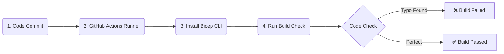

## 🌐 Project 1: Enterprise Hub-Spoke Network Topology (IaC & CI/CD)

### 📊 Network Traffic Detour Path
This layout isolates your workloads. Instead of a direct shortcut (bypass) between Production (A) and Data (C), your code forces all data packets to take an enforced detour through the security checkpoint in the Hub (B).

```mermaid
graph TD
    A[A: Production Subnet] --->|1. Enforced Detour via UDR| B(B: Central Hub Router IP 10.0.1.4)
    B --->|2. Approved Traffic Delivery| C[C: Private Data Subnet]

    A <.-.-> |VNet Peering| B
    C <.-.-> |VNet Peering| B
```

### 🤖 Automated CI/CD Pipeline Diagram
Every code commit triggers an automated compilation pipeline that validates the infrastructure layout for free without logging into an Azure account.



### 🧠 Core Architectural Strategy Explained
* **The Peering Transit Flag (`allowForwardedTraffic: true`):** By default, Azure virtual network peering is non-transitive. Setting this flag to `true` authorizes the Hub network to act as an active middleman router, accepting and passing along packets it did not originate.
* **The User-Defined Route Override (UDR):** Injected a custom Route Table directly into the Production application subnet. This forces an explicit detour rule: any packet bound for the database subnet (`10.2.0.0/16`) is blocked from routing directly and is forced into the central router IP (`10.0.1.4`) in the Hub first.
