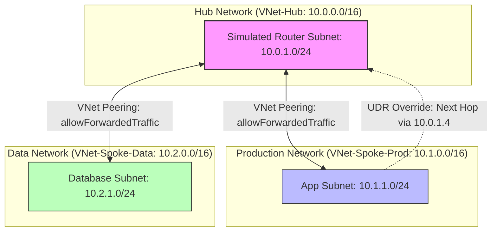

### 📊 Project 1 Architectural Layout

```mermaid
graph TD
    subgraph Hub_VNet ["Hub Network (VNet-Hub: 10.0.0.0/16)"]
        NVA[Simulated Router Subnet: 10.0.1.0/24]
    end

    subgraph Prod_Spoke ["Production Network (VNet-Spoke-Prod: 10.1.0.0/16)"]
        App[App Subnet: 10.1.1.0/24]
    end

    subgraph Data_Spoke ["Data Network (VNet-Spoke-Data: 10.2.0.0/16)"]
        DB[Database Subnet: 10.2.1.0/24]
    end

    %% Network Peerings
    NVA <--> |VNet Peering: allowForwardedTraffic| App
    NVA <--> |VNet Peering: allowForwardedTraffic| DB

    %% User Defined Routing Table
    App -.-> |UDR Override: Next Hop via 10.0.1.4| NVA
    style NVA fill:#f9f,stroke:#333,stroke-width:2px
    style App fill:#bbf,stroke:#333,stroke-width:1px
    style DB fill:#bfb,stroke:#333,stroke-width:1px
```
