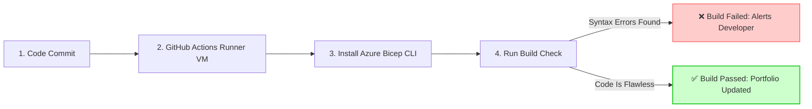

## 🌐 Project 1: Enterprise Hub-Spoke Network Topology (IaC & CI/CD)

### 📊 Network Architecture Diagram
This topology isolates your critical workloads. Instead of a direct shortcut (bypass) between the Production App (A) and Private Data (C), all traffic is forced to take a monitored detour through the Central Hub (B).

```mermaid
graph TD
    subgraph Hub_VNet ["B: Central Hub Network (10.0.0.0/16)"]
        NVA[Security & Router Subnet: 10.0.1.0/24]
    end

    subgraph Prod_Spoke ["A: Production Network (10.1.0.0/16)"]
        App[App Subnet: 10.1.1.0/24]
    end

    subgraph Data_Spoke ["C: Private Data Network (10.2.0.0/16)"]
        DB[Database Subnet: 10.2.1.0/24]
    end

    %% Enforced Traffic Detour Path
    App ===> |1. Enforced Detour via UDR Table| NVA
    NVA ===> |2. Approved Traffic Delivery| DB

    %% Peering Relationship Lines
    NVA <.-.-> |VNet Peering: allowForwardedTraffic| App
    NVA <.-.-> |VNet Peering: allowForwardedTraffic| DB

    style NVA fill:#f9f,stroke:#333,stroke-width:2px
    style App fill:#bbf,stroke:#333,stroke-width:1px
    style DB fill:#bfb,stroke:#333,stroke-width:1px
```

### 🤖 Automated CI/CD Pipeline Diagram
Every code commit triggers an automated, passwordless compilation pipeline that validates the underlying infrastructure block structural layout for free.



### 🧠 Core Architectural Strategy Explained
* **The Peering Transit Flag (`allowForwardedTraffic: true`):** By default, Azure virtual network peering is non-transitive. Setting this flag to `true` authorizes the Hub network to act as an active middleman router, accepting and passing along packets it did not originate.
* **The User-Defined Route Override (UDR):** Injected a custom Route Table directly into the Production application subnet. This forces an explicit detour rule: any packet bound for the database subnet (`10.2.0.0/16`) is blocked from routing directly and is forced into the central router IP (`10.0.1.4`) in the Hub first.
